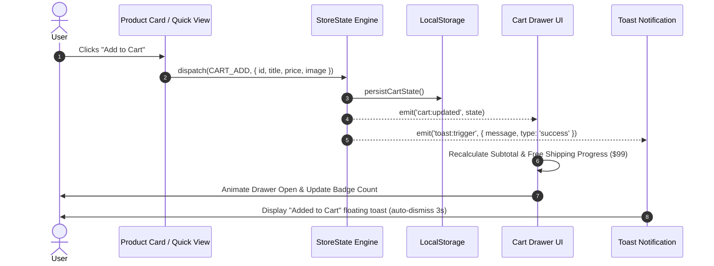

# ShopCart Frontend System Design & Architecture

This document defines the production system design, technical architecture, state management lifecycle, and component composition model for the **ShopCart** e-commerce platform.

---

## 1. Architectural Principles

1. **Progressive Enhancement**: The storefront delivers core semantic HTML and accessible browsing first. JavaScript enhances experiences (slide-out cart, live countdown, quick view modal, toast feedback) without breaking basic functionality.
2. **Zero Layout Shift (CLS = 0)**: All image elements, hero visual containers, and card slots define explicit aspect ratios (`aspect-ratio: 1 / 1`, `3 / 2`), preventing shifts during asset loading.
3. **Decoupled Event-Driven State**: Cart, wishlist, and notification states operate via a lightweight Pub/Sub event bus. UI components do not tightly couple to storage or rendering engines.
4. **Resilient Local Persistence**: Cart items and customer wishlist selections are automatically synchronized with browser `localStorage`, ensuring continuity across visits and page refreshes.
5. **Fluid Typography & Responsive Grids**: Utilizing CSS `clamp()` for display titles and native CSS Grid for 6-column desktop to 1-column mobile layouts without runtime media query listeners.

---

## 2. Component Composition Hierarchy

```mermaid
graph TD
  App["App Shell (index.html)"] --> Nav["Header & Navigation Organisms"]
  App --> Main["Main Viewport"]
  App --> Footer["Mega Footer Organism"]
  App --> Overlays["Global Overlays & Portals"]

  Nav --> Announcement["AnnouncementBar (Molecule)"]
  Nav --> MainHeader["MainHeader (Organism)"]
  MainHeader --> Logo["BrandLogo (Atom)"]
  MainHeader --> Search["SearchBar (Molecule)"]
  MainHeader --> NavMenu["NavLinks (Molecules)"]
  MainHeader --> UserActions["Cart & Account Buttons (Atoms)"]

  Main --> Hero["HeroShowcase (Organism)"]
  Hero --> HeroContent["HeroCTA & Badges (Molecules)"]
  Hero --> HeroVisual["PedestalDisplay (Molecule)"]
  Hero --> TrustBar["TrustGuarantees (Molecule)"]

  Main --> Categories["CategoryGrid (Organism)"]
  Categories --> CatCard["CategoryCard (Molecule)"]

  Main --> Catalog["ProductCatalog (Organism)"]
  Catalog --> ProductCard["ProductCard (Molecule)"]
  ProductCard --> WishlistBtn["WishlistTrigger (Atom)"]
  ProductCard --> QuickViewBtn["QuickViewTrigger (Atom)"]
  ProductCard --> RatingStars["RatingStars (Atom)"]
  ProductCard --> PriceTag["PriceDisplay (Atom)"]
  ProductCard --> AddToCartBtn["AddToCartButton (Atom)"]

  Main --> FlashSale["FlashSaleBanner (Organism)"]
  FlashSale --> Timer["CountdownTimer (Molecule)"]

  Main --> Brands["BrandCarousel (Organism)"]
  Brands --> BrandLogo["BrandLogoSVG (Atoms)"]

  Main --> Split1["SocialProofModule (Organism)"]
  Split1 --> Testimonial["CustomerTestimonial (Molecule)"]
  Split1 --> StatsGrid["WhyShopWithUsStats (Molecule)"]

  Main --> Split2["ConversionModule (Organism)"]
  Split2 --> Newsletter["NewsletterForm (Molecule)"]
  Split2 --> Instagram["InstagramGallery (Molecule)"]

  Main --> Split3["EditorialModule (Organism)"]
  Split3 --> BlogList["BlogCardList (Molecule)"]
  Split3 --> FAQ["FAQAccordion (Molecule)"]

  Overlays --> CartDrawer["SlideOverCartDrawer (Organism)"]
  Overlays --> QuickView["QuickViewModal (Organism)"]
  Overlays --> Toast["ToastNotificationSystem (Molecule)"]
```



---

## 3. Data Flow & State Management

State transitions follow a single-source-of-truth unidirectional pipeline managed by the `StoreState` engine.



### State Schema Contract
```typescript
interface ProductItem {
  id: string;
  title: string;
  price: number;
  originalPrice?: number;
  rating: number;
  reviewCount: number;
  image: string;
  category: string;
}

interface CartItem extends ProductItem {
  quantity: number;
}

interface StoreState {
  cart: {
    items: CartItem[];
    subtotal: number;
    freeShippingThreshold: number; // 99.00
    isFreeShippingUnlocked: boolean;
  };
  wishlist: Set<string>; // Set of product IDs
  activeFilter: string | null;
  searchQuery: string;
}
```

---

## 4. Performance & Core Web Vitals (CWV)

### Largest Contentful Paint (LCP) < 1.2s
- **Hero Image Priority**: The hero smartwatch visual is pre-rendered with high priority:
  ```html
  
  ```
- **Self-Contained Fonts**: System font fallback stack ensures zero FOIT (Flash of Invisible Text) while Google Fonts load asynchronously.

### Interaction to Next Paint (INP) < 50ms
- **CSS-Driven Drawer & Modal Animations**: Offloaded to GPU compositing via `transform: translateX()` and `opacity` transitions.
- **Debounced Live Search**: Product search queries use immediate DOM class toggling without blocking main thread execution.

### Cumulative Layout Shift (CLS) = 0
- Fixed aspect-ratio containers (`aspect-ratio: 1 / 1` on product cards and category thumbnails) reserve geometry before bitmaps decode.

---

## 5. Accessibility (a11y) & WCAG 2.1 AA Conformance

1. **Focus Trap & Dialog Semantics**:
   - Cart Drawer and Quick View Modals utilize native HTML5 dialog semantics or `role="dialog"`, `aria-modal="true"`, and `aria-label`.
   - Pressing `Escape` or clicking the overlay immediately restores focus to the invoking trigger.
2. **Accessible Form Controls**:
   - Form inputs provide explicit `<label>` or `aria-label`.
   - Checkboxes are natively checkable via `Space` key with visual `:focus-visible` focus rings.
3. **Screen Reader Live Regions**:
   - Dynamic cart updates output announcements via `aria-live="polite"`.

---

## 6. Shopify Liquid Architecture Mapping

When integrating into the Shopify Horizon theme, components map cleanly to Liquid primitives:

| ShopCart Component | Shopify Horizon Primitive | Liquid File Location |
| :--- | :--- | :--- |
| **Top Announcement Bar** | Section | `sections/header-announcements.liquid` |
| **Global Header & Navbar** | Section | `sections/header.liquid` |
| **Hero Pedestal Showcase** | Section + Blocks | `sections/hero.liquid` / `blocks/hero-banner.liquid` |
| **Category Grid** | Section | `sections/collection-list.liquid` |
| **Best Selling Products** | Section + Product Card | `sections/product-list.liquid` + `snippets/product-card.liquid` |
| **Flash Sale Countdown** | Section | `sections/flash-sale.liquid` |
| **Brands Ticker** | Section | `sections/marquee.liquid` |
| **Testimonial & Stats** | Section | `sections/media-with-content.liquid` |
| **Newsletter & Instagram** | Section | `sections/newsletter.liquid` |
| **Blog & FAQ** | Section | `sections/featured-blog-posts.liquid` + `blocks/accordion.liquid` |
| **Slide-over Cart Drawer** | Section / Drawer | `sections/cart-drawer-section.liquid` |
